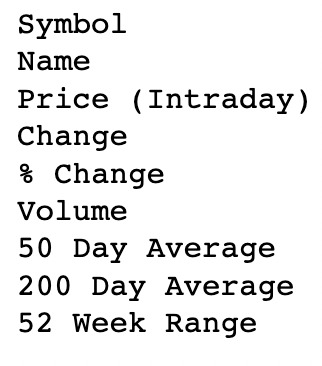
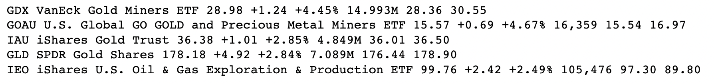

## Introduction

Web scraping is a powerful tool for data scientists, offering the ability to gather valuable information from the vast expanse of the internet. In this blog post, I want to explore the art of web scraping, introduce the process of building a web scraping bot, and discuss web scraping ethics. While I won't delve into complex technical details, having a comprehensive overview of the methods behind scraping the web are important for data scientists looking to harness this technology.

## The Basics of Web Scraping

First off, what is web scraping and how is it used in the world of data science? Web scraping, or web crawling, is the process of extracting data from websites. It allows you to collect information such as text, images, prices, and more, turning unstructured web content into structured data that can be analyzed.

Data scientists can leverage web scraping to gather diverse data sources, enriching their datasets for analysis, research, and modeling. This practice can be applied across various industries, from finance to healthcare, e-commerce, and more.

Now that we understand a little more about scraping the web, let’s begin writing our code. This tutorial will use Python and its web scraping packages that are free and available to use for everyone.

## Building a Web Scraping Bot

The process of building our bot can be broken up into 3 simple steps:

1. Define: Before diving into web scraping, clearly define what data you want to collect and what specific websites you'll target. This ensures that your web scraping project remains focused and efficient.
2. Select: Select a suitable web scraping tool or library, like Rvest, BeautifulSoup, Scrapy, or Selenium, depending on your project's complexity and your coding skills.
3. Build: Finally, begin building your bot by using your chosen tool or library to develop a script to collect data from the websites. This script should mimic a user's interaction with the website, navigating through pages and collecting the desired information.

I will leave it up to you to determine the exact purpose of your bot. For this tutorial, we are interested in scraping information from yahoo finance, a website that is frequently updated with the latest stock market prices. We will be looking specifically at Exchange-Traded Fund, or ETF prices. 

For this tutorial we will be using requests and BeautifulSoup, packages built for Python.

#### 1. Import Packages

Begin by importing the following packages through the terminal:

```{python}
import requests
from bs4 import BeautifulSoup
import time
```

The requests package in Python is a widely used library for making HTTP requests to interact with web services and retrieve web content. It simplifies the process of sending HTTP requests and handling responses, making it easy for us to get data from the web.

On the other hand, BeautifulSoup is a Python library for parsing and navigating HTML and XML documents. It enables us to extract, manipulate, and navigate structured data within web pages.

Lastly, we will import the time package because it help us later on with automating our bot. 

#### 2. Get URL and Parse HTML

The next step is to get our URL. We will then parse the HTML from the website, which is a fancy way of saying that we'll extract and process the content of the web page, enabling us to work with the data it contains.

```{python}
url = 'https://finance.yahoo.com/etfs'
response = requests.get(url) 
text = response.text 
data = BeautifulSoup(text, 'html.parser') 
```

#### 3. Get Headings from the Table

```{python}
headings = data.find_all('tr')[0] 
headings_list = []  # list to store all headings 

for x in headings: 
    headings_list.append(x.text) 
 
headings_list = headings_list[:10] 
```

In our code, `headings = data.find_all('tr')[0]` means we want to find all the HTML `<tr>` (table row) elements within the parsed HTML content stored in the data variable. We select the first one (`[0]`), because the first row of the table contains the headings.

We then use a for loop to append each heading to our `headings_list`. Since we only need the first 10 columns, we will use `headings_list[:10]`. 

Printing out our columns, we get:



#### 4. Fill Columns

Now we want to get the first 5 rows of our data:

```{python} 
for x in range(1, 6): 
    table = data.find_all('tr')[x] 
    c = table.find_all('td') 
      
    for x in c: 
        print(x.text, end=' ') 
    print('') 
```

Here is our output after printing out the first 5 rows:



#### 5. Full Implementation

Now that we have our setup in place, the last thing to do is place it in a loop. We use the time package in Python to help us read the new data in once every 10 minutes. Here is the full implementation:

```{Python}
import requests 
from bs4 import BeautifulSoup 
from datetime import datetime 
import time 
  
while(True): 
    now = datetime.now() 

    current_time = now.strftime("%H:%M:%S") 
    print(f'At time : {current_time} IST') 
  
    response = requests.get('https://finance.yahoo.com/etfs') 
    text = response.text 
    html_data = BeautifulSoup(text, 'html.parser') 
    headings = html_data.find_all('tr')[0] 
    headings_list = [] 
    for x in headings: 
        headings_list.append(x.text) 
    headings_list = headings_list[:10] 
  
    data = [] 
  
    for x in range(1, 6): 
        row = html_data.find_all('tr')[x] 
        column_value = row.find_all('td') 
        dict = {} 
          
        for i in range(10): 
            dict[headings_list[i]] = column_value[i].text 
        data.append(dict) 
          
    for coin in data: 
        print(coin) 
        print('') 
    time.sleep(600) 
```

The code starts with an infinite while loop, which means it will run indefinitely unless you manually stop it. This loop ensures that the script continues to execute repeatedly. The timestamp from `current_time = now.strftime("%H:%M:%S") `is printed to the console to indicate when the data is being fetched.

Finally, the script pauses execution for 600 seconds (equivalent to 10 minutes) using `time.sleep(600)`. This delay ensures that the code waits for the next iteration. After the sleep period, the loop starts over and fetches and displays the data again.

#### 6. Hosting Methods

If necessary, there are ways to implement the bot without the need for human intervention. In this tutorial we won't get into hosting our bot, but it is another step to take in making your scraping more efficient. 

## Web Scraping Ethics

#### Respect the Terms of Service
Always review a website's terms of service to determine if web scraping is allowed. Some websites explicitly prohibit scraping, and violating these terms may lead to legal consequences.

#### Rate Limiting and Politeness
Implement rate limiting in your bot to avoid overloading a website's servers. Crawling a site too aggressively can disrupt its operations and lead to IP bans.

#### Data Privacy and Consent
Be cautious when scraping sensitive or personal information. Ensure that you comply with privacy laws and obtain consent if necessary.

#### Transparency
If you plan to use scraped data in a public setting, provide clear attribution to the source, respecting intellectual property and copyright laws

## Happy Scraping

That's it! Thanks for reading, and feel free to reach out with any questions. 
